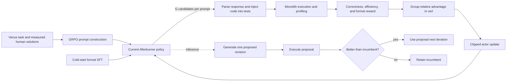

# Afterburner GRPO Methodology: Technical Analysis

**Repository:** `Elfsong/Afterburner`  
**Local revision inspected:** `ee3f90e15420aee5ae294683ed7c011a645f7d05` (`main`)  
**Analysis date:** 2026-09-10  
**Scope:** the repository's Afterburner-specific GRPO methodology, its upstream `verl` dependency, the execution-grounded reward, the cold-start stage, and the iterative evaluation loop. The unrelated TRL/Unsloth demonstration notebooks are identified but are not treated as the experiment implementation.

## Executive summary

Afterburner applies GRPO to a code-revision task rather than to code generation from a blank prompt. Each training prompt contains a programming problem, one existing solution, that solution's measured correctness and resource use, and one requested objective: runtime, peak memory, or the time-memory integral. The current policy samples a group of alternative revisions. Every candidate is parsed, inserted into a Venus test harness, executed by the remote Monolith sandbox, and assigned a scalar reward. `verl` then standardizes rewards within the candidates generated for the same prompt and performs a critic-free, PPO-style clipped policy update.

The distinctive part of the method is therefore not a new GRPO optimizer. It is the environment and reward design:

1. **State/context:** problem + baseline code + baseline measurements + requested efficiency dimension.
2. **Action:** a structured response containing reasoning and revised code.
3. **Environment:** empirical execution in Monolith against repeated tests.
4. **Outcome reward:** relative correctness transition, relative efficiency gain, and output-format compliance.
5. **Within-prompt credit assignment:** group-relative reward standardization supplied by `verl`; no learned value model is required.

This is a coherent way to turn code optimization into online RL: the policy explores several possible rewrites and receives measurements on its own current outputs instead of learning only from static human pairs. It also has material reproducibility gaps. The paper, checked-in training script, and active reward code disagree on the rollout count, epoch count, format penalty, and reward weights. The repository does not pin a `verl` version, leaves the reward-function path as a placeholder, uses non-deterministic dataset sampling, and depends on a remote sandbox. The shown iterative evaluation path also selects a *larger* integral as better and fails to feed its accepted/rolled-back `_updated` dataset into the next iteration.

## 1. Evidence model and terminology

This report distinguishes three evidence levels:

- **Repository behavior:** directly implemented by the checked-in source and configuration. This is the strongest evidence for what the current repository would do.
- **Paper-reported experiment:** described in the authors' [Afterburner paper](https://arxiv.org/html/2505.23387). This is the strongest evidence for the published experiment, but it is not always identical to the current repository.
- **Framework behavior:** supplied by upstream [`verl`](https://github.com/verl-project/verl). Because this repository does not pin a `verl` release or commit, exact defaults are version-dependent. Framework-default claims are therefore conditional unless the local script overrides them.

The word **baseline** has two different meanings and should not be conflated:

- The *input baseline solution* is the code included in a prompt and used by the task reward to determine whether the candidate improved correctness or efficiency.
- The *GRPO group baseline* is the mean reward of sibling rollouts for the same prompt. It is used to calculate relative advantages and replaces a learned critic.

## 2. Method boundaries: three connected loops

Afterburner consists of three connected but distinct loops.



1. **Training loop:** grouped online sampling, execution, reward calculation, and actor updates.
2. **Execution loop:** candidate extraction, test-harness construction, remote execution, and measurement. It is nested inside each training reward batch.
3. **Test-time iterative optimization loop:** propose one revision, evaluate it, greedily retain the better solution, and repeat. This loop demonstrates the capability learned during training; it is not itself a parameter-update loop.

The paper describes the iterative loop explicitly as a greedy incumbent update ([paper, Section 3 and Algorithm 1](https://arxiv.org/html/2505.23387)). The repository's corresponding implementation is in [`venus_afterburner_pipeline`](../evaluation/venus/venus_evaluator.py#L505-L696).

## 3. Repository map: canonical path versus experiments

### 3.1 Canonical Afterburner GRPO path

| Stage | Primary artifact | Role |
|---|---|---|
| Dataset conversion | [`grpo/afterburner_dataset.py`](../grpo/afterburner_dataset.py) | Builds `verl`-compatible Parquet rows from Venus Python tasks. |
| Reward/environment adapter | [`grpo/afterburner_reward_function.py`](../grpo/afterburner_reward_function.py) | Parses rollouts, executes them in Monolith, and returns batch rewards. |
| Distributed training recipe | [`grpo/afterburner_train.sh`](../grpo/afterburner_train.sh) | Selects GRPO in `verl` and configures data, actor, vLLM rollouts, FSDP, logging, and checkpoints. |
| Cold-start collection | [`evaluation/venus/venus_cold_start_batch_generation.py`](../evaluation/venus/venus_cold_start_batch_generation.py) | Generates structured examples with Gemini for format-alignment SFT. |
| Iterative generation/evaluation | [`evaluation/venus/venus_evaluator.py`](../evaluation/venus/venus_evaluator.py) | Runs generation, Monolith evaluation, percentile scoring, and incumbent selection. |
| Uncertainty estimation | [`evaluation/venus/venus_bootstrap.py`](../evaluation/venus/venus_bootstrap.py) | Samples repeated executions and reports means and nominal 95% intervals. |

### 3.2 Non-canonical demonstrations

[`grpo/train_grpo.py`](../grpo/train_grpo.py), [`grpo/grpo_demo.py`](../grpo/grpo_demo.py), `grpo/grpo.ipynb`, and the Unsloth notebooks train on NuminaMath, TLDR, or GSM8K using TRL/Unsloth rewards. They are useful API experiments, but they do not use Venus, Monolith, the Afterburner prompt, or the production reward. They must not be used to infer the published Afterburner configuration.

## 4. End-to-end training methodology

### 4.1 Source task distribution

The dataset builder loads `Elfsong/Venus_Python` and consumes both its train and test splits ([dataset builder, lines 39-45](../grpo/afterburner_dataset.py#L39-L45)). A source example must supply at least:

- `problem_id` and `question_content`;
- a list of measured `solutions`, each containing `code`, `passed`, `time`, `memory`, and `integral`;
- `test_case_runners`, `test_case_evaluator`, and serialized `test_cases`, which are carried through `extra_info` for online execution.

The paper describes Venus as a collection of algorithmic tasks with validated test generation and many human reference solutions. It reports 2,181 Python training tasks and 300 test tasks in one dataset description, but later says the GRPO subset uses 984 distinct Venus training tasks. The repository contains no selection/filter script that reconciles those two counts, so the exact published GRPO task filter is not recoverable from this checkout ([paper, dataset preparation](https://arxiv.org/html/2505.23387)).

### 4.2 Prompt construction and baseline sampling

For every source task and every efficiency objective, the builder selects one input solution with Python's unseeded `random.choice` ([lines 48-63](../grpo/afterburner_dataset.py#L48-L63)). The prompt contains:

\[
X = (P, I, C_{in}, M_{in}),
\]

where (P) is the problem, (I\in\{time,memory,integral\}), (C_{in}) is the randomly selected baseline code, and (M_{in}) contains its pass flag, runtime, peak memory, and integral.

The model is instructed to:

- repair the code if the baseline fails;
- otherwise optimize the requested metric;
- return a complete solution in one fenced code block;
- wrap reasoning and solution in `<thinking>...</thinking><solution>...</solution>` through the system message.

The three objective-specific maps are concatenated, producing nominally three GRPO rows per original example when `sample_num = 1` ([lines 94-110](../grpo/afterburner_dataset.py#L94-L110)). Each row records:

```text
data_source: "Elfsong/Venus_Python"
prompt: [system message, user message]
ability: "code"
reward_model:
  style: "rule"
  ground_truth: <the selected baseline solution and measurements>
extra_info:
  split: train | test
  problem_id: ...
  efficiency_instruction: time | memory | integral
  instance: <complete Venus example including tests>
  case_multiply: 64
```

`ground_truth` is a misleading field name here: it is not a desired response. It is the baseline solution used for relative reward calculation. The GRPO dataset therefore requires no target completion, consistent with online RL.

### 4.3 Cold-start format alignment

The paper reports a two-stage GRPO model pipeline:

1. Gemini 2.5 Pro produces 3,392 raw structured responses; regex filtering retains 2,071 examples.
2. Qwen2.5-3B-Instruct is fully fine-tuned for one epoch on those examples, then that checkpoint initializes GRPO.

The reported cold-start SFT uses a 32,768-token maximum sequence length, learning rate (5\times10^{-5}), 50 warm-up steps, effective batch size 4, and `adamw_bnb_8bit` ([paper, Appendix E.4-E.5](https://arxiv.org/html/2505.23387)).

The closest repository artifact is [`venus_cold_start_batch_generation.py`](../evaluation/venus/venus_cold_start_batch_generation.py#L69-L157): it constructs examples for all three efficiency instructions, asks `gemini-2.5-pro-preview-03-25` for a 4,096-token thinking budget, samples batches of 128, and uploads each batch. The script does not contain the subsequent SFT command, filtering/merge procedure, or a manifest of the 2,071 retained rows. A second older script, [`data_curation/grpo_data.py`](../data_curation/grpo_data.py), creates a different QwQ-32B reasoning dataset and should not be assumed to reproduce the paper's cold start.

The collection script also mutates its own sampling population: after the first `random.sample(batch_cases, 128)`, `batch_cases` contains only those 128 rows, so each of the remaining 99 loop iterations resamples from that same first subset rather than from the full candidate pool ([lines 143-157](../evaluation/venus/venus_cold_start_batch_generation.py#L143-L157)). The associated filtering notebook keeps rows whose `response` and `thinking` fields are non-null but does not require a successfully parsed `solution_code` (`evaluation/venus/venus_cold_start.ipynb`). These behaviors cannot directly yield the diverse 2,071-example paper dataset without an untracked correction or separate process.

The checked-in GRPO launcher initializes from `Elfsong/Qwen2.5-Coder-3B-Venus-Cold-Start` ([training recipe, line 23](../grpo/afterburner_train.sh#L23)), while the paper names a Qwen2.5-3B-Instruct base. The repository does not document whether the checkpoint name is only a naming difference or a genuinely different base model.

### 4.4 Grouped rollout generation

The launcher invokes `python3 -m verl.trainer.main_ppo` but selects `algorithm.adv_estimator=grpo` ([lines 11-13](../grpo/afterburner_train.sh#L11-L13)). `main_ppo` is the historical `verl` entry point for a family of PPO-like loops; choosing GRPO removes the need for critic/value estimation and changes advantage construction.

For each global prompt batch:

- `data.train_batch_size=32` supplies 32 distinct prompt rows;
- `actor_rollout_ref.rollout.n=32` samples 32 candidates for each prompt;
- therefore one nominal rollout batch contains (32\times32=1,024) response trajectories before filtering or framework-specific packing;
- rollouts use vLLM with temperature 1.0, response length up to 8,192 tokens, prompt length up to 2,048 tokens, and tensor parallel size 2 ([lines 15-19 and 35-41](../grpo/afterburner_train.sh#L15-L41)).

The paper instead reports 16 candidates per prompt, so its nominal batch would contain (32\times16=512) trajectories if the prompt batch size was the same. This is one of several reasons the checked-in launcher should be treated as a later recipe, not an exact run manifest.

### 4.5 Candidate parsing and test-harness construction

The custom batch reward receives `data_sources`, generated strings, baseline dictionaries, and `extra_info`. For each candidate it:

1. finds all `<solution>` blocks and chooses the last one;
2. finds all fenced code blocks inside that solution and chooses the last one;
3. substitutes the extracted code into the Venus `test_case_runners` template;
4. nests the resulting code in `running_solution()`;
5. creates one `unittest` method per test case;
6. repeats the test-case list 64 times;
7. POSTs the complete program to `https://monolith.cool/execute` with profiling enabled and a 90-second execution timeout.

The parsing path is implemented at [reward lines 144-188](../grpo/afterburner_reward_function.py#L144-L188). Malformed structure produces an empty submitted solution rather than a separate parser error. The language label on the Markdown fence is captured but never validated. The candidate is considered correct only if the sandbox reports `status == "success"` and stdout is exactly `Success\n` ([lines 190-207](../grpo/afterburner_reward_function.py#L190-L207)).

The test repetition is measurement amplification: it increases the amount of work inside one profiled execution so differences among short programs are easier to observe. It is not 64 independent sandbox runs. By contrast, evaluation's `data_multiply=16` duplicates complete sandbox submissions and measures the same generated code repeatedly.

### 4.6 Monolith execution environment

The response supplies four outcome fields:

\[
(passed, time, memory, integral).
\]

The paper defines the integral as

\[
integral = \int_0^{time} memory(t)\,dt,
\]

so it penalizes both duration and memory occupancy. The paper reports 81 Docker workers on a GCP `n2-highcpu-96` machine; each worker receives one vCPU, 1 GB of memory, CPU affinity, and a fresh temporary directory. Runtime and peak memory are measured with `time -v`, while `/proc/<pid>/status` is sampled for instantaneous RSS and the integral ([paper, Appendix H](https://arxiv.org/html/2505.23387)).

The reward function mirrors this capacity with up to 81 local request threads ([lines 221-234](../grpo/afterburner_reward_function.py#L221-L234)). Client-side threading hides sandbox latency but does not make reward computation local. Training throughput and repeatability remain dependent on service availability, queueing, container images, machine state, and network behavior.

Failed candidates are normalized to 90 seconds, (10^9) memory units, and (10^{10}) integral units before reward calculation ([lines 228-232](../grpo/afterburner_reward_function.py#L228-L232)). Subsequent clipping reduces those sentinels to the configured ceilings.

## 5. Reward function: exact implementation

### 5.1 Correctness transition reward

Let (p_b) be the baseline pass flag and (p_c) the candidate pass flag. The repository implements ([lines 110-115](../grpo/afterburner_reward_function.py#L110-L115)):

\[
R_c =
\begin{cases}
+1.0 & \neg p_b \land p_c \\ 
+0.5 & p_b \land p_c \\ 
-0.5 & \neg p_b \land \neg p_c \\ 
-1.0 & p_b \land \neg p_c.
\end{cases}
\]

This is denser than a candidate-only pass/fail reward. It explicitly distinguishes repair, preservation, continued failure, and regression. It also aligns training with the intended revision task: preserving already-correct behavior is good, but repairing a failing baseline is better.

### 5.2 Relative efficiency reward

For the requested metric (e\in\{time,memory,integral\}), both baseline and candidate measurements are clipped:

\[
\bar e = \operatorname{clip}(e,0,e_{max}),
\]

then relative gain and reward are computed as:

\[
g = \operatorname{clip}\left(\frac{\bar e_b-\bar e_c}{\bar e_b+10^{-9}},-1,1\right),
\qquad
R_e = \tanh(g).
\]

This is implemented by `safe_delta` ([lines 94-99](../grpo/afterburner_reward_function.py#L94-L99)). Lower resource consumption is better, positive gains indicate improvement, the denominator expresses gain relative to the baseline, and clipping plus `tanh` bounds outliers. Because (g\in[-1,1]), the actual range is approximately ([-0.7616,+0.7616]), not the full open interval ((-1,1)).

The ceilings are 90 seconds, 1,048,576 memory units, and (1{,}048{,}576\times90=94{,}371{,}840) integral units ([lines 249-252](../grpo/afterburner_reward_function.py#L249-L252)). Efficiency contributes only when the candidate passes, implemented by `efficiency_weight = 0.5 if fc_score > 0 else 0` ([lines 254-267](../grpo/afterburner_reward_function.py#L254-L267)). Since the only positive correctness states are the two candidate-passes cases, this gating is equivalent to (p_c=1).

The intermediate improvement score is therefore:

\[
R_{improve}=R_c+0.5\,\mathbf{1}[p_c]R_e.
\]

### 5.3 Format reward

The active regex requires exactly one top-level `<thinking>...</thinking>` block followed by one `<solution>...</solution>` block ([lines 117-131](../grpo/afterburner_reward_function.py#L117-L131)). The repository assigns:

\[
R_f = 1\text{ if matched, else }0.
\]

The paper says the non-matching case receives (-1). That difference changes the maximum separation between valid and invalid outputs from 0.4 in the paper's weighted formulation to 0.2 in the code's final formulation.

### 5.4 Final active reward

The source declares `beta_l=0.3`, `beta_i=0.5`, and `beta_f=0.2`, but length reward is commented out and a constant zero is supplied in its place ([lines 294-313](../grpo/afterburner_reward_function.py#L294-L313)). Thus the actual scalar returned to `verl` is:

\[
R_{repo}=0.5R_{improve}+0.2R_f
=0.5R_c+0.25\,\mathbf{1}[p_c]R_e+0.2R_f.
\]

The paper specifies:

\[
R_{paper}=0.5R_c+0.3\,\mathbf{1}[p_c]R_e+0.2R_f,
\]

with (R_f\in\{-1,+1\}) ([paper, reward equations and Appendix E.5](https://arxiv.org/html/2505.23387)). The active code therefore uses a 0.25 effective efficiency coefficient rather than 0.30 and a 0/1 format signal rather than -1/+1.

Representative repository reward ranges are:

| Baseline → candidate | (R_c) | Efficiency active? | Final range with bad format | Final range with good format |
|---|---:|---:|---:|---:|
| fail → fail | -0.5 | no | -0.25 | -0.05 |
| pass → fail | -1.0 | no | -0.50 | -0.30 |
| fail → pass | +1.0 | yes | 0.3096 to 0.6904 | 0.5096 to 0.8904 |
| pass → pass | +0.5 | yes | 0.0596 to 0.4404 | 0.2596 to 0.6404 |

The table shows the intended priority ordering: correctness transitions dominate ordinary efficiency changes. A correct but slower rewrite can still be positively rewarded, while breaking a passing baseline remains negative even with valid formatting.

### 5.5 Interaction with group normalization

The raw reward is not the final learning signal. For each prompt (x), `verl` groups the (G) sampled candidates and computes an outcome advantage approximately as:

\[
A_i=\frac{R_i-\mu_x}{\sigma_x+\epsilon}.
\]

The scalar is broadcast across the generated tokens under the response mask. Upstream `verl` documents GRPO as critic-free grouped sampling with relative rewards, and its current implementation computes the group mean and standard deviation from outcome scores ([`verl` GRPO documentation](https://github.com/verl-project/verl/blob/main/docs/algo/grpo.md), [`compute_grpo_outcome_advantage`](https://github.com/verl-project/verl/blob/main/verl/trainer/ppo/core_algos.py)).

Consequences:

- A candidate is rewarded for being better than its siblings, not merely for having a positive absolute raw score.
- If every rollout in a group receives the same reward, their group-relative advantages collapse to zero and that prompt produces no policy-gradient signal.
- Global positive affine scaling of all rewards within a group would be mostly removed by standardization. Relative component weights still matter because correctness, format, and efficiency vary differently among siblings.
- Empirical timing noise can keep within-group variance non-zero, as the paper argues, but it can also mis-rank near-identical programs. Repeated, isolated measurement is therefore methodologically central rather than an implementation detail.

## 6. Actor objective and optimization

### 6.1 Critic-free PPO-style update

GRPO avoids training a value network. Given old-policy rollouts and group advantages, the actor uses an importance ratio

\[
w_{i,t}(\theta)=\frac{\pi_\theta(o_{i,t}\mid x,o_{i,<t})}
{\pi_{old}(o_{i,t}\mid x,o_{i,<t})}
\]

inside a clipped surrogate objective. Conceptually:

\[
L(\theta)=-\mathbb{E}_{i,t}
\left[\min\left(w_{i,t}A_i,
\operatorname{clip}(w_{i,t},1-\epsilon,1+\epsilon)A_i\right)\right].
\]

The Afterburner paper's displayed Equation 10 appears malformed: it omits (A_i) from the first `min` argument and prints the clipping bounds in reverse order. The surrounding prose and the upstream framework describe the conventional PPO-style form above. This should be treated as a typesetting error, not as an executable specification.

### 6.2 KL and entropy

The launcher explicitly sets both possible KL mechanisms to false:

- `actor_rollout_ref.actor.use_kl_loss=False`;
- `algorithm.use_kl_in_reward=False`.

It also sets `entropy_coeff=0` ([lines 28-31 and 44](../grpo/afterburner_train.sh#L28-L44)). Thus there is no explicit reference-policy KL penalty and no entropy bonus in the checked-in recipe. The adjacent `kl_loss_coef=0.001` and `kl_loss_type=low_var_kl` are inert while KL loss is disabled. The paper matches this high-level choice and attributes greater exploration partly to removing KL restriction.

This does **not** mean updates are unconstrained: PPO-style ratio clipping still limits individual policy steps. It does mean there is no additional force anchoring the actor to its cold-start reference distribution.

### 6.3 Batching and distributed execution

The actor uses:

- learning rate (10^{-6});
- global PPO mini-batch 32;
- micro-batch 4 per GPU;
- eight GPUs on one node;
- remove-padding optimization and gradient checkpointing;
- FSDP without parameter or optimizer offload for the actor;
- reference-policy parameter offload configured, although reference log probabilities may be unnecessary when both KL paths are disabled;
- vLLM rollout tensor parallelism of 2 and GPU memory utilization 0.5;
- save and validation frequency every 10 trainer steps;
- no validation before training.

See [training recipe, lines 23-53](../grpo/afterburner_train.sh#L23-L53). The paper says training used a single node with eight H100 GPUs ([implementation details](https://arxiv.org/html/2505.23387)).

Several algorithmically relevant values are not set: actor PPO epochs per rollout batch, clipping ratio, loss aggregation mode, advantage standard-deviation normalization, optimizer type, scheduler, warmup, weight decay, and seed. These fall back to whichever `verl` version is installed. The current upstream documentation says its default loss aggregation is token-mean, while the original GRPO formulation uses sequence-mean/token-mean, but the historical experiment cannot be assigned either behavior confidently without the missing `verl` revision.

## 7. Paper versus repository configuration

| Parameter | Paper-reported run | Checked-in launcher | Assessment |
|---|---:|---:|---|
| Initial model | `Afterburner_CS` from Qwen2.5-3B-Instruct | `Elfsong/Qwen2.5-Coder-3B-Venus-Cold-Start` | Potential base-model/name mismatch. |
| GRPO epochs | 20 | 200 | Direct mismatch. |
| Rollouts per prompt | 16 | 32 | Direct mismatch; doubles execution and rollout load. |
| Prompt batch | not stated in Appendix E | 32 | Repo-only. |
| PPO mini-batch | 32 | 32 | Match. |
| Per-GPU micro-batch | 4 | 4 | Match. |
| Actor learning rate | (10^{-6}) | (10^{-6}) | Match. |
| Temperature | 1.0 | 1.0 | Match. |
| KL actor loss | disabled | disabled | Match. |
| KL in reward | implied disabled | disabled | Match. |
| Entropy coefficient | 0 | 0 | Match. |
| Format reward | +1 / -1 | +1 / 0 | Direct mismatch. |
| Correctness coefficient | 0.5 | effective 0.5 | Match. |
| Efficiency coefficient | 0.3 | effective 0.25 | Direct mismatch. |
| Format coefficient | 0.2 | 0.2 | Match. |
| Response length | not stated | 8,192 | Repo-only. |
| `verl` version | not stated | not pinned | Exact optimizer defaults unrecoverable. |

The paper is the appropriate source for interpreting published metrics. The current repository is the appropriate source for auditing the downloadable recipe. Neither alone is a complete reproducibility package.

## 8. Test-time iterative optimization

Training teaches a single-step revision policy, but evaluation composes that policy repeatedly. At iteration (k):

1. Build a prompt from the problem, objective, incumbent code, and the incumbent's averaged measured metrics.
2. Generate one proposal at temperature 0 with up to 8,192 tokens ([generation call](../evaluation/venus/venus_evaluator.py#L565-L578)).
3. Execute the proposal repeatedly in Monolith.
4. Apply a greedy selection rule:
   - if both incumbent and proposal fail, take the proposal;
   - if the incumbent passes and proposal fails, retain the incumbent;
   - if only the proposal passes, take it;
   - if both pass, retain the lower requested metric.
5. Save the selected code as the next iteration's input dataset.

The implementation uses `all(repeated_run.passed)` for the proposal pass flag and averages absolute time, memory, and integral over repeated runs ([lines 643-653](../evaluation/venus/venus_evaluator.py#L643-L653)). This is conservative about correctness: one flaky failure marks the proposal as failed.

There is a material defect in the integral branch. Time and memory correctly select smaller values, but integral selects the proposal when `new_solution_integral > original_generation['integral']` ([lines 662-676](../evaluation/venus/venus_evaluator.py#L662-L676)). The training reward, metric definition, and paper all treat a smaller integral as better. Unless a different external script produced the published iterative datasets, this branch would greedily retain worse integral values.

The demonstrated iteration wiring has a second defect. Accepted/rolled-back solutions are written under `output_dataset_config + '_updated'`, but the function returns the unmodified `output_dataset_config` ([lines 678-696](../evaluation/venus/venus_evaluator.py#L678-L696)). The commented example loop assigns that return value to the next iteration ([lines 858-864](../evaluation/venus/venus_evaluator.py#L858-L864)). Consequently, the next iteration reads the raw evaluated proposal set rather than the greedily selected `_updated` set. The checked-in example therefore does not actually propagate its acceptance/rollback decisions across iterations.

## 9. Evaluation methodology

### 9.1 Functional correctness

Pass@1 is the fraction of generated solutions passing all test cases. Failed solutions contribute zero to all aggregate efficiency scores, so the reported Beyond metrics jointly reflect correctness and efficiency rather than conditioning only on passed generations ([score accumulation](../evaluation/venus/venus_evaluator.py#L625-L632)).

### 9.2 Relative efficiency percentiles

Absolute measurements are hardware-sensitive. Evaluation therefore compares a generated solution with the distribution of passing human/reference solutions for the same task. `percentage_position` sorts reference measurements and returns

\[
1-\frac{\#\{d\in D:d<x\}}{|D|}
=\frac{\#\{d\in D:d\ge x\}}{|D|},
\]

matching the paper's percentile-rank definition ([utility implementation](../utils.py#L353-L359)). Lower generated measurements yield higher percentiles. Beyond-T, Beyond-M, and Beyond-I average those task/run-level percentiles over the full evaluation set, with failures contributing zero.

### 9.3 Repeated runs and interval estimation

The evaluator commonly sets `case_multiply=64`, `data_multiply=16`, 81 request workers, and a 90-second timeout ([evaluator construction and examples](../evaluation/venus/venus_evaluator.py#L781-L814)). The bootstrap script groups results by problem, then for each of 128 replicates samples up to four measured runs per problem without replacement and recomputes aggregate Pass, Beyond-T, Beyond-M, and Beyond-I ([bootstrap lines 20-66](../evaluation/venus/venus_bootstrap.py#L20-L66)). It reports a Student-(t) interval over the 128 replicate aggregates ([lines 68-102](../evaluation/venus/venus_bootstrap.py#L68-L102)).

This is not a conventional nonparametric bootstrap in two respects: it samples four observations without replacement rather than resampling with replacement, and it calculates a (t)-interval across replicate metrics rather than percentile bounds. The procedure still quantifies run-selection variability, but its intervals should be described precisely rather than assumed to have standard bootstrap coverage guarantees.

### 9.4 Reported outcome

The paper reports that, at iteration 10 on Venus, Afterburner-GRPO reaches 61.67 Pass@1, 45.17 Beyond-T, 48.05 Beyond-M, and 38.95 Beyond-I, compared with 27.99, 12.40, 13.24, and 10.29 for the Qwen2.5-3B baseline. It also reports that removing feedback at iteration 4 lowers GRPO Pass@1 by 4.49 points and Beyond-T/M/I by 6.66/6.19/3.64 points; removing original code lowers the three Beyond metrics by 8.64/7.43/9.27 points ([paper, results and ablation](https://arxiv.org/html/2505.23387)).

These results support the value of measured feedback and revision context, but they do not isolate every design choice in the reward. There are no reported ablations for reward coefficients, group size, KL removal, test repetition, clipping ceilings, or the three efficiency objectives separately.

## 10. Methodological strengths

1. **Direct alignment with the real objective.** The reward uses measured runtime and memory rather than proxies such as code length or static complexity.
2. **Correctness-preserving shaping.** Efficiency is gated on passing tests, and breaking a passing baseline receives the largest negative correctness transition.
3. **Dense relative signal.** Correct-to-correct candidates can still be ranked by resource gains; fail-to-pass revisions receive a strong repair bonus.
4. **Problem-local normalization.** GRPO compares strategies on the same task and baseline, avoiding meaningless absolute reward comparisons across problems with different scales.
5. **Critic-free training.** Eliminating a value model reduces memory relative to PPO-style actor-critic training and avoids having to learn values for very long code sequences.
6. **Exploration through online candidates.** Unlike static SFT/DPO pairs, the actor is trained on measured outputs from its current policy.
7. **Training/inference correspondence.** Both stages expose the model to baseline code and empirical performance, enabling repeated self-revision at test time.
8. **Noise-aware evaluation intent.** Container isolation, CPU affinity, repeated execution, task-relative percentiles, and replicate intervals acknowledge that code-efficiency measurements are stochastic.

## 11. Limitations, discrepancies, and failure modes

### 11.1 High-impact reproducibility issues

| Issue | Evidence | Impact |
|---|---|---|
| Paper/launcher drift | 20 vs 200 epochs; 16 vs 32 rollouts | Published compute, sample count, and policy trajectory cannot be reproduced from the launcher verbatim. |
| Paper/reward drift | format -1 vs 0; efficiency weight 0.30 vs effective 0.25 | Published objective is not identical to the checked-in objective. |
| Unpinned `verl` | no `verl` entry or version pin in [`grpo/requirements.txt`](../grpo/requirements.txt) | Clip ratio, loss aggregation, PPO epochs, optimizer defaults, and config compatibility may drift. |
| Placeholder reward path | [`afterburner_train.sh`, line 20](../grpo/afterburner_train.sh#L20) | Launcher is not runnable without manual repair. |
| Non-expanded output path | `local_dir="~/data/venus"` is passed directly to `os.path.join` ([dataset lines 40-42 and 112-113](../grpo/afterburner_dataset.py#L40-L113)) | Python does not expand `~` automatically in ordinary filesystem strings; export can fail or target a literal `~` directory. |
| Non-deterministic data | unseeded `random.choice` per mapping pass | Baseline code and reward scale change on every rebuild. |
| Remote mutable environment | hard-coded `https://monolith.cool/execute` | Training is not self-contained; environment/version drift and availability affect rewards. |
| Integral comparator reversed | [`venus_evaluator.py`, lines 672-676](../evaluation/venus/venus_evaluator.py#L672-L676) | Iterative integral optimization can retain empirically worse candidates. |
| Selected incumbent not propagated | [`venus_evaluator.py`, lines 678-696](../evaluation/venus/venus_evaluator.py#L678-L696) | The shown multi-iteration loop feeds raw proposals, not the accepted/rolled-back dataset, into the next step. |
| Cold-start pool collapses after batch 1 | [`venus_cold_start_batch_generation.py`, lines 143-157](../evaluation/venus/venus_cold_start_batch_generation.py#L143-L157) | Later batches repeatedly sample only the first 128 rows, undermining coverage and the reported dataset lineage. |

### 11.2 Reward and parsing risks

- **Reward hacking through tests:** the policy sees test harness metadata indirectly through `extra_info` only in the evaluator, not in the prompt, which is good; nevertheless, a finite test suite can still be overfit by generated code.
- **No explicit safety/static filtering:** arbitrary generated Python is sent to Monolith. Isolation is therefore part of the security boundary, not merely a performance tool.
- **Parser permissiveness:** only the last solution/code block matters, and the fence language is ignored. A response can satisfy the format regex while containing unusable code.
- **Format/correctness coupling:** malformed tags usually cause both a lost format bonus and an empty-code execution failure. This compounds penalties and can make format alignment disproportionately important early in training.
- **Efficiency ceiling saturation:** solutions at or beyond the timeout/memory ceiling become indistinguishable on that metric. This is useful for robustness but removes gradient among very poor programs.
- **Baseline-relative asymmetry:** the same absolute saving is rewarded more when the baseline is small because the gain is fractional. Extremely small baseline values make the denominator sensitive despite the epsilon.
- **Within-group zero variance:** groups in which every candidate fails identically produce no GRPO learning signal after normalization, even though their absolute rewards are bad.
- **Noise-induced ranking:** near-tied candidates may be ordered by system noise. Group standardization can amplify small noisy differences when group standard deviation is small.

### 11.3 Engineering and governance risks

- The checked-in requirements look largely like a copied inference-server dependency set and omit central training packages such as `verl`; they are not a minimal or locked environment.
- There are no unit tests for reward transitions, parser edge cases, clipping, coefficient composition, or greedy selection.
- Errors in `performance_evalution` are swallowed into a generic failure response ([lines 212-219](../grpo/afterburner_reward_function.py#L212-L219)), reducing observability and conflating model failures with infrastructure failures.
- The sandbox execution timeout and HTTP read timeout are both 90 seconds. Network overhead can turn an otherwise valid sandbox timeout result into a client timeout classification.
- `length_reward_fn_batch` is disabled and would currently fail if enabled because it passes a Python list to `safe_minmax`, which expects NumPy methods.
- [`data_curation/grpo_data.py`](../data_curation/grpo_data.py#L34-L46) contains a tracked provider credential rather than reading it from the environment. The credential should be revoked and removed from history; its value is intentionally not reproduced here.
- Training and evaluation write datasets/checkpoints to external mutable services without checked-in manifests or hashes, making artifact lineage hard to audit.

### 11.4 Scope limitation

Although the top-level README describes a six-language Venus dataset, the GRPO path hard-codes Python in dataset prompts, execution requests, and harness construction. The methodology as implemented here is Python-only. Multilingual claims describe the broader Venus/Monolith ecosystem, not this GRPO recipe.

## 12. Reproduction contract the repository would need

A defensible reproduction should freeze the following as one versioned experiment manifest:

1. Git commit for this repository and exact `verl`, vLLM, PyTorch, Transformers, tokenizer, and model revisions.
2. Hashes/revisions for Venus train/test data, the 984-task filter if applicable, cold-start examples, and the cold-start checkpoint.
3. Dataset-generation seed and the chosen baseline solution ID for every objective/task row.
4. Exact reward implementation and a declaration of whether paper or repository coefficients are authoritative.
5. Monolith server/container image revisions, CPU model, worker allocation, measurement units, sampling interval, and queue/concurrency policy.
6. Full resolved Hydra configuration, not only CLI overrides.
7. Training seed, optimizer/scheduler parameters, PPO epochs, clip ratio, loss aggregation, advantage-normalization flag, and checkpoint selection rule.
8. Evaluation generation parameters, number of iterations, case multiplier, complete-run multiplier, greedy comparison rules, and bootstrap seed.
9. Immutable result datasets with problem IDs, generated code, all raw repeated measurements, pass outcomes, and aggregate scripts.

At minimum, a corrected local execution sequence would be:

```text
Venus revision
  -> deterministic afterburner_dataset.py export
  -> verified cold-start checkpoint
  -> pinned verl environment + resolved Hydra config
  -> local/versioned Monolith endpoint
  -> GRPO run with immutable logs and checkpoints
  -> iterative evaluation with corrected integral comparator
  -> raw repeated measurements
  -> percentile and uncertainty report
```

## 13. Bottom-line interpretation

Afterburner's methodological contribution is best understood as **execution-grounded, relative policy optimization for iterative code revision**. GRPO is the credit-assignment and policy-update mechanism; Venus supplies diverse baselines and tests; Monolith converts generated programs into measurable outcomes; and the custom reward orders correctness before resource efficiency while maintaining a machine-parseable response contract.

The approach is strongest where static preference learning is weakest: it can discover and reinforce optimizations produced by the current policy, including transformations absent from a fixed SFT/DPO pair set. Its scientific validity, however, depends heavily on measurement fidelity and exact experiment bookkeeping. In this checkout, the conceptual method is clear, but the published run is not exactly reproducible without resolving configuration drift, pinning upstream behavior, reconstructing the cold-start/data manifests, and fixing the integral selection error.

## Primary sources

- Du et al., [*Afterburner: Reinforcement Learning Facilitates Self-Improving Code Efficiency Optimization*](https://arxiv.org/html/2505.23387).
- Shao et al., [*DeepSeekMath: Pushing the Limits of Mathematical Reasoning in Open Language Models*](https://arxiv.org/abs/2402.03300), the original GRPO source cited by Afterburner.
- `verl`, [GRPO documentation](https://github.com/verl-project/verl/blob/main/docs/algo/grpo.md) and [`compute_grpo_outcome_advantage`](https://github.com/verl-project/verl/blob/main/verl/trainer/ppo/core_algos.py).
- Local repository artifacts linked throughout this report.
